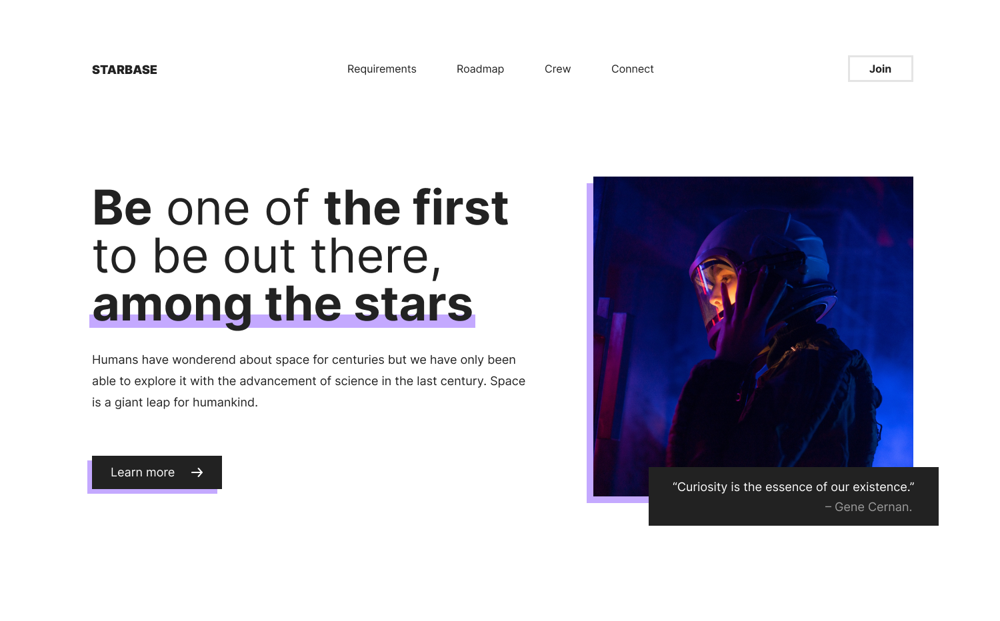

# Starbase (single-page website)

## Overview

Website for an imaginary space-exploration company which is recruiting members to a new misson.

  

## Objective

Design and build a performant, responsive, accessible landing-page for an imaginary space-exploration company. The website should have a single page where users can understand the main goal of the company - recruit new members for the exploration team. The layout should be responsive and accessible. Images should be served with performance in mind (i.e. using modern image formats such as webp).

## Stack

- Figma (Design)
- HTML
- CSS
- Sass
- JavaScript

 Features

- Responsive layout (Flexbox, Grid).
- Use of performant image formats (webp).

## Development

As the main goal was to create the website and not the design itself, I used an existing design from dribble and changed to what I felt was relevant to a space-exploration website. The original design can be found [here]("https://dribbble.com/shots/17065504-Digital-agency-landing-page-design).

With the design taken care of I started developing the website. To do so, I made sure all the necessary resources were saved in the project folder (images in 1x, 2x, 3x sizes for high density displays, svgs). CSS variables were also defined before hand to be used later on (colors, shadows, gradients, etc).

Started the development by building the basic components such as buttons, frames, image-cards, h1 titles, callouts, etc., which could be put together and compose the final result.

With the basic components finished, I hopped on to sections which are nothing more than a 1x2 (1 row, 2 columns) responsive grid-container with the previous components put togsether. This made sure the layout would behave responsively when the viewport was smaller (tablets, phones).

After all sections were finished, I put them all together in the index file and the page was completed. This approach is super efficient as everything can be maintained separately.

Navigation bar was a bit of a headache as it had to change the entire layout in smaller viewports. Used a burguer button which was hidden in large screens and would become visible in smaller screen sizes. Navigation items would also change to a column layout is smaller devices to make better use of space.

## Conclusion
User is greeted with a hero section containing a description of what the website is about and an image frame. On top of the hero section the navigation bar displays all the sections that can be scrolled to by clicking on the corresponding navigation item. Layout respects the different screen sizes and structures the inner content accordingly.
Final result met my expectations since the goal was a completely responsive layout and I achieved it.
